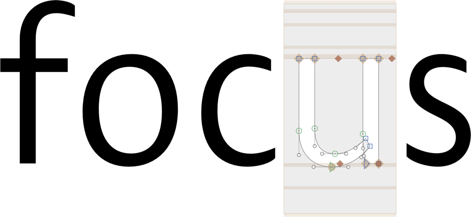

# Show Glyph Focus

This is a plugin for the [Glyphs font editor](http://glyphsapp.com/) by Georg Seifert.
It highlights the current glyph. Also handy for spotting open paths and overlaps.



Installation of this filter will add the menu item *View > Show Glyph Focus* (de: *Ansicht > Fokus auf aktuelle Glyphe*). You can set a keyboard shortcut in System Preferences.

### Installation

1. In *Window > Plugin Manager,* look for *Show Glyph Focus* and click *Install.*
2. Restart Glyphs

### Settings
You are able to control color fo the focus rectangle.
In order to do that you have to define the the color by running small script in macro window (Windows > Macro):

```Python
# for normal os mode
Glyphs.defaults["com.mekkablue.ShowGlyphFocus.color"] = (1, 0, 0, 1)
# for os in dark mode
Glyphs.defaults["com.mekkablue.ShowGlyphFocus.colorDarkMode"] = (0, 0, 0.5, 0.4)
```
You can put any color values you want into the parentesis.
Color is defined in RGBA (Red Green Blue Alpha/Opacity) format, where you set the component color values with float numbers between 0 and 1 (where 0 = 0% and 1 = 100%).


### Requirements

The plugin needs Glyphs 2.5 or higher, running on OS X 10.9 or later.

### License

Copyright 2018 Rainer Erich Scheichelbauer (@mekkablue).
Based on sample code by Georg Seifert (@schriftgestalt).

Licensed under the Apache License, Version 2.0 (the "License");
you may not use this file except in compliance with the License.
You may obtain a copy of the License at

http://www.apache.org/licenses/LICENSE-2.0

See the License file included in this repository for further details.
